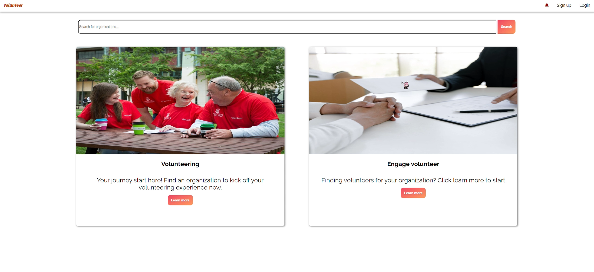
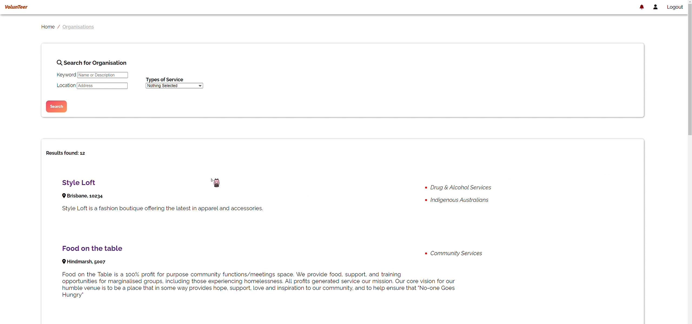
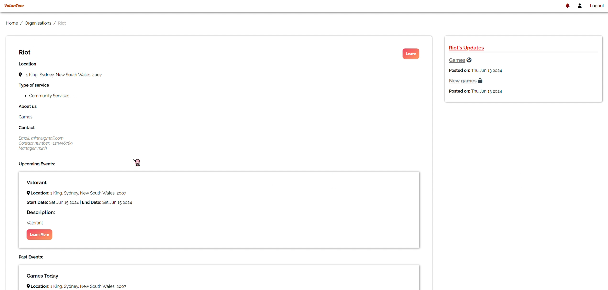
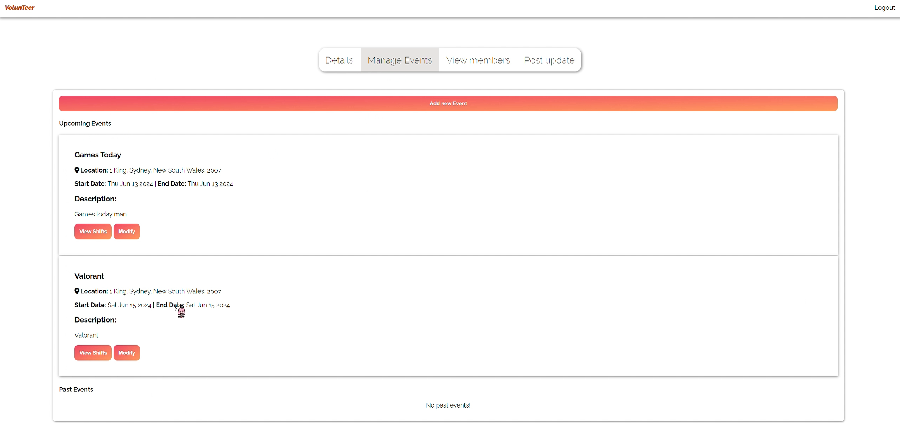
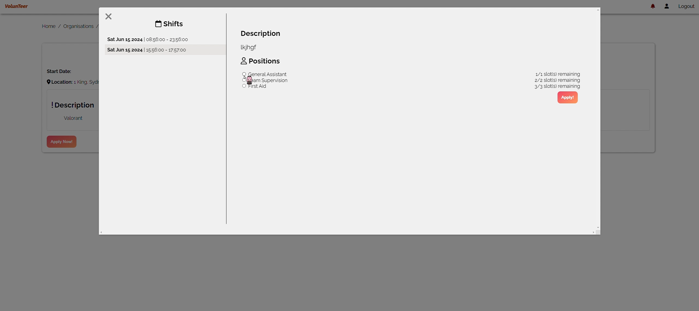
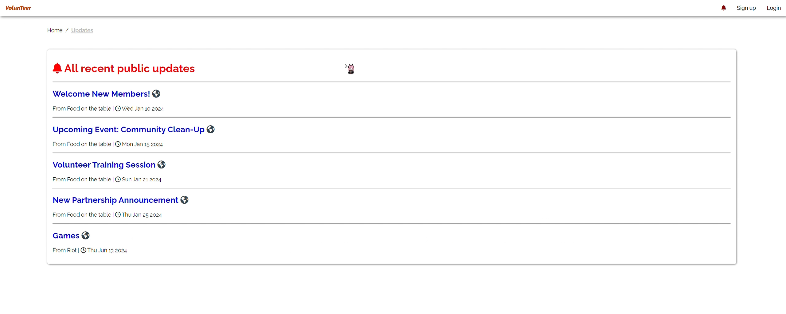
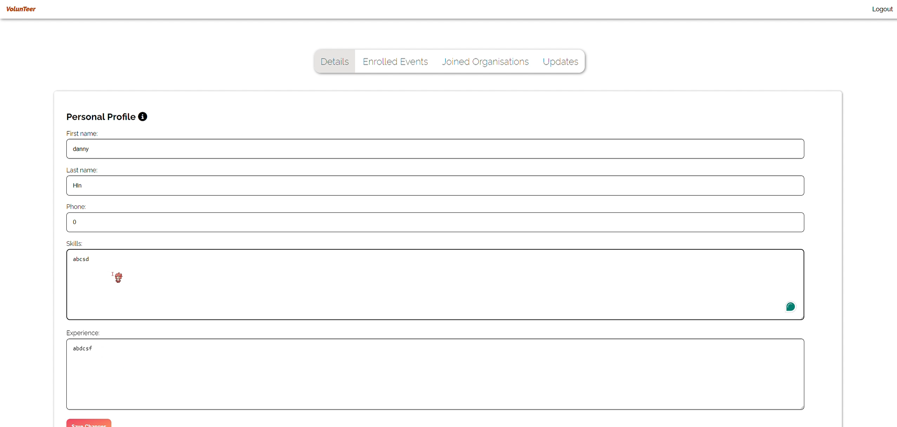
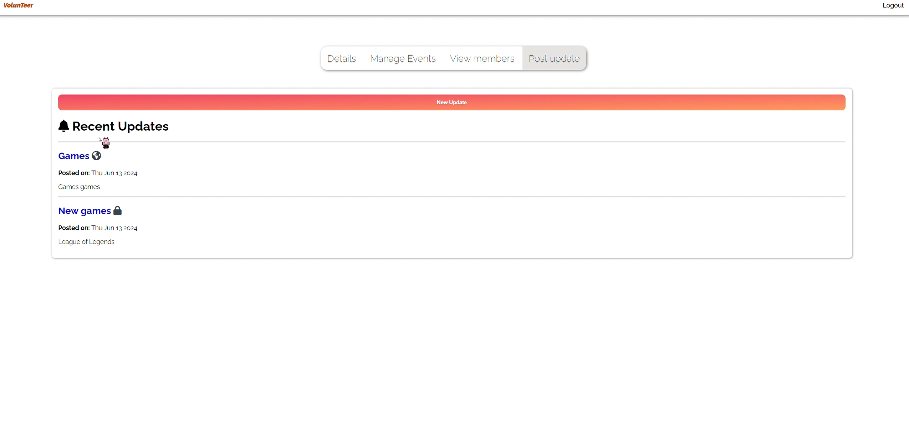
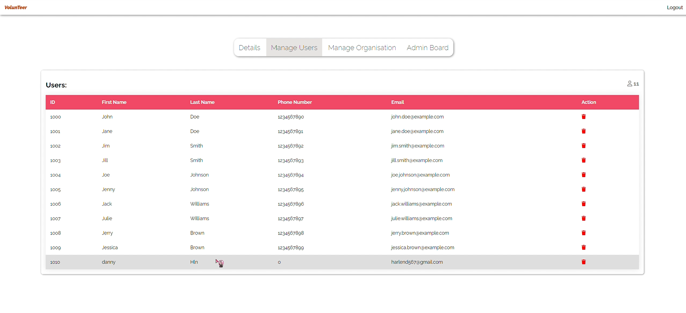

# Volunteer Connect

Volunteer Connect is an innovative web platform that bridges passionate volunteers with organizations in need. The platform simplifies volunteer management by providing a unified hub where both volunteers and organizations can create and update their profiles, join communities, and communicate in real‑time.

[](mailto:duybao21560@gmail.com)
[](https://tssniper349.github.io)
[](https://www.linkedin.com/in/tssniper349)

## Overview

Volunteer Connect is designed for two primary user groups:

- **Volunteers**: 
  - Sign in using their Google account.
  - Search and filter organizations by type, category, or location to find the right match.
  - Join organizations, browse available events and shifts, and apply for specific shifts.
  - Receive real‑time in-app notifications and email updates about new opportunities or changes.

- **Organizations**:
  - Create and maintain a public profile, similar to other social platforms.
  - Post events with multiple shifts to accommodate diverse volunteer needs.
  - Manage volunteer applications and member information.
  - Send updates via email to all their members whenever there’s a new announcement or change.

## Key Features

- **Google Login Integration:** Secure authentication through Google OAuth for seamless sign-ins.
- **Search & Filter:** Volunteers can search and filter organizations based on interests, type, or location.
- **Profile Management:** Both volunteers and organizations can modify their profiles and update personal information.
- **Event & Shift Management:** Organizations can post events with multiple shift options, and volunteers can easily sign up.
- **Real-Time Notifications:** Instant updates for volunteers via in-app notifications.
- **Email Updates:** Organizations can automatically dispatch email updates to all their members.
- **Robust Database:** Uses MySQL for reliable, scalable data management.
- **Backend Powered by Node.js & Express:** Provides lightweight, efficient RESTful API endpoints.

## Architecture & Technologies

- **Backend:** Built with [Node.js](https://nodejs.org/) and [Express](https://expressjs.com/), offering a clean RESTful API.
- **Database:** Uses [MySQL](https://www.mysql.com/) for managing user profiles, events, organization details, and more.
- **Authentication:** Integrated with Google OAuth for secure user login.
- **Email Service:** Integrated email services for sending organization updates to member emails.
- **Frontend:** A responsive and user-friendly interface that allows easy search, filtering, and profile management.

## Screenshots

Take a visual tour of Volunteer Connect through these screenshots:

<div style="display: flex; flex-wrap: wrap; justify-content: space-around;">

  <div style="flex: 0 0 45%; margin-bottom: 10px;">
    
    <p align="center"><strong>Home Page</strong></p>
  </div>

  <div style="flex: 0 0 45%; margin-bottom: 10px;">
    
    <p align="center"><strong>Search &amp; Filter Organizations</strong></p>
  </div>

  <div style="flex: 0 0 45%; margin-bottom: 10px;">
    
    <p align="center"><strong>Organization Profile</strong></p>
  </div>

  <div style="flex: 0 0 45%; margin-bottom: 10px;">
    
    <p align="center"><strong>Event Creation</strong></p>
  </div>

  <div style="flex: 0 0 45%; margin-bottom: 10px;">
    
    <p align="center"><strong>Shift Application</strong></p>
  </div>

  <div style="flex: 0 0 45%; margin-bottom: 10px;">
    
    <p align="center"><strong>Real-Time Notifications</strong></p>
  </div>

  <div style="flex: 0 0 45%; margin-bottom: 10px;">
    
    <p align="center"><strong>User Profile Managment</strong></p>
  </div>

  <div style="flex: 0 0 45%; margin-bottom: 10px;">
    
    <p align="center"><strong>Organization Profile Management</strong></p>
  </div>

  <div style="flex: 0 0 45%; margin-bottom: 10px;">
    
    <p align="center"><strong>Administrator Page</strong></p>
  </div>

</div>

## Getting Started

### Prerequisites

- [Node.js](https://nodejs.org/) (v14 or above)
- [MySQL](https://www.mysql.com/) server
- Google Developer account for OAuth credentials

### Installation

1. **Clone the repository:**
    ```bash
    git clone https://github.com/yourusername/volunteer-connect.git
    cd volunteer-connect
    ```

2. **Install dependencies:**
    ```bash
    npm install
    ```

3. **Configure Environment Variables:**

   Create a `.env` file in the root directory with the following:
    ```env
    PORT=3000
    DB_HOST=your_mysql_host
    DB_USER=your_mysql_user
    DB_PASS=your_mysql_password
    DB_NAME=your_database_name
    JWT_SECRET=your_secret_key
    GOOGLE_CLIENT_ID=your_google_client_id
    GOOGLE_CLIENT_SECRET=your_google_client_secret
    EMAIL_SERVICE_API_KEY=your_email_service_api_key
    ```

4. **Set Up MySQL Database:**

   Import the provided `schema.sql` file to set up the necessary tables:
    ```bash
    mysql -u your_mysql_user -p your_database_name < schema.sql
    ```

5. **Start the Server:**
    ```bash
    npm run dev
    ```

6. **Access the Application:**

   Open your browser and navigate to [http://localhost:3000](http://localhost:3000).

## Usage

- **For Volunteers:**
  - Sign in using your Google account.
  - Use the search and filter functionality to find organizations that match your interests.
  - Join organizations, browse events and shifts, and apply for volunteer opportunities.
  - Receive real‑time notifications and email updates on new opportunities.

- **For Organizations:**
  - Create and update your public profile.
  - Post events with multiple shift options.
  - Manage volunteer applications and member information.
  - Automatically send email updates to all members when new announcements are posted.

## Contributing

Contributions are welcome! Please review our [CONTRIBUTING.md](CONTRIBUTING.md) file for guidelines on how to contribute.

## License

This project is licensed under the MIT License. See the [LICENSE](LICENSE) file for more details.

---

Volunteer Connect is built to make volunteering simple, engaging, and efficient—bringing together communities and organizations with just a few clicks. Feedback and contributions are highly appreciated!

Happy coding,  
Paul
